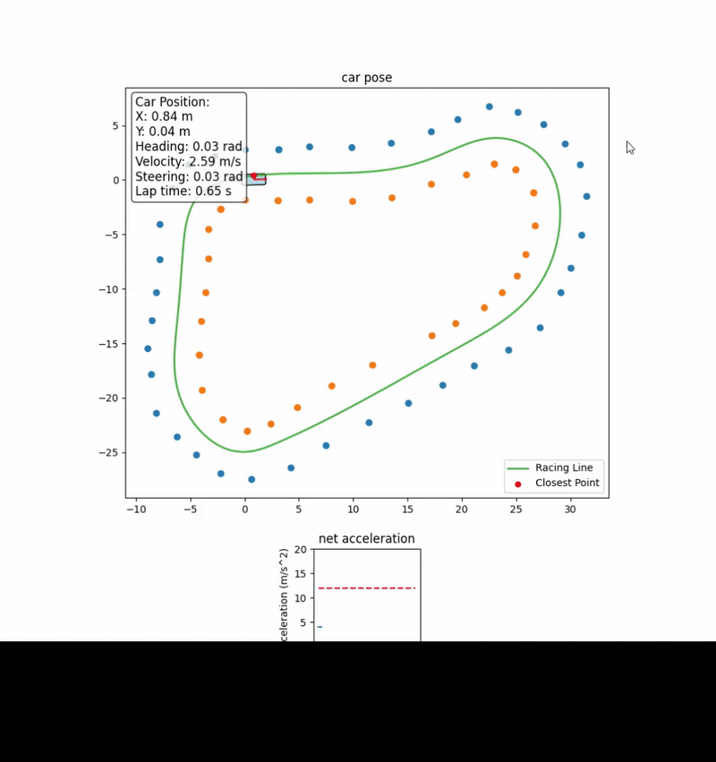

# FEB Autonomous Car Controller

<div align="center">
  
</div>

This project implements a full autonomous driving controller for a cone-defined racetrack.

The system constructs a smooth spline path from raw cone positions, generates a physically feasible velocity
profile using combined lateral/longitudinal acceleration limits, and drives the vehicle with a combination of
**PID longitudinal control** and **Model Predictive Control (MPC)** for steering.

The result is a stable, smooth lap with correct handling in straights, corners, and chicanes—while fully obeying
vehicle limits on steering, steering rate, and acceleration.

---

## 🚗 Overview

The vehicle is represented by a 5-state model:

$$
[x,\; y,\; \phi,\; v,\; \theta]
$$

- $x, y$: position  
- $\phi$: heading  
- $v$: velocity  
- $\theta$: steering angle  

The controller outputs:

$$
[a,\; \dot{\theta}]
$$

- $a$: commanded acceleration  
- $\dot{\theta}$: steering rate  

Simulation runs at **100 Hz**, and the MPC solves at **20 Hz**.

---

## 🛣 Track Processing & Path Generation

1. Cones are processed using Delaunay triangulation.  
2. Midpoints between cone pairs are ordered into a continuous racing corridor.  
3. A **cubic B-spline** is fit through the midpoints.  
4. The spline is parameterized in normalized arc-length $s \in [0,1]$.

For any value of $s$, we can compute:

- position on the path  
- tangent direction  
- curvature  
- second derivative  

This enables fast closest-point projection and curvature-based speed limits.

---

## ⚡ Physically Feasible Velocity Profile (GG-Diagram)

To prevent the vehicle from exceeding physical tire limits, the controller enforces a maximum combined acceleration of **12 m/s²**.

Cornering acceleration:

$$
a_{\text{lat}} = v^2 \lvert \kappa \rvert
$$

Maximum safe cornering speed:

$$
v_{\text{corner}} = \sqrt{\frac{a_{\text{max}}}{\lvert \kappa \rvert}}
$$

The algorithm computes:

- a forward pass (acceleration-feasible)  
- a backward pass (braking-feasible)  
- drag-limited acceleration  

Final reference profile:

$$
v_{\text{desired}} = \min\!\left(v_{\text{corner}},\; v_{\text{accel}},\; v_{\text{brake}}\right)
$$

This ensures the car slows appropriately for tight corners and accelerates efficiently on straights.

---

## 🎯 Longitudinal Control (PID)

A PID controller tracks the desired velocity profile.  
Before applying the acceleration command, it is constrained by:

- wheel acceleration limits  
- remaining GG-envelope after lateral load  
- aerodynamic drag  

This produces human-like behavior:

- ✅ full throttle on straights  
- ✅ smooth braking into corners  
- ✅ seamless transitions  

---

## 🧠 Lateral Control (MPC)

Steering is computed with a nonlinear CasADi MPC.

The MPC uses the state:

$$
[e_y,\; e_\psi,\; \theta]
$$

where $e_y$ is lateral deviation and $e_\psi$ is heading error.

The cost function penalizes:

- lateral error  
- heading error  
- steering effort  

Steering limits are dynamically tightened based on predicted velocity and curvature, ensuring stability at high speeds.

The result is precise centerline tracking with very low oscillation.

---

## 📊 Logging, Plots & Analysis

The controller records:

- path progress  
- lateral error  
- heading error  
- reference vs actual velocity  
- net acceleration usage  
- car position  
- lap detection and lap times  

Tools provided:

| Function | Description |
|----------|-------------|
| `plot_velocity_and_mpc_analysis()` | velocity tracking & lateral error over time |
| `plot_velocity_vs_position()` | velocity & acceleration vs arc length |
| `plot_path_s_and_position_over_time()` | spline progress & XY position |

Simulation output includes static plots and the animated GIF shown above.

---

## ▶ Running the Project

Install dependencies:

```bash
pip install numpy matplotlib scipy casadi
